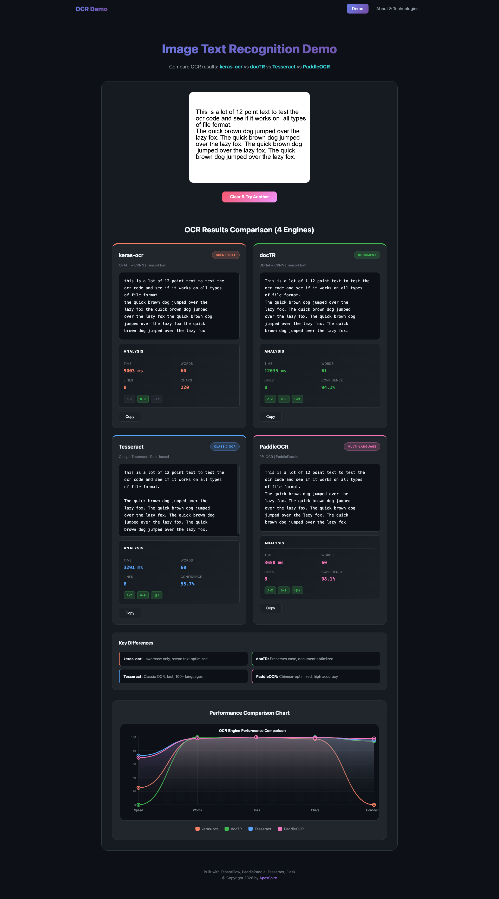

# Image Text Recognition Web App

A web application that extracts text from images (OCR) using Python, TensorFlow, and keras-ocr.

## Features

- Upload images via drag-and-drop or file browser
- Extract text from scanned documents and photos
- Support for multiple image formats (PNG, JPG, GIF, BMP, TIFF, WebP)
- Copy extracted text to clipboard
- Clean, responsive web interface

## Technology Stack

- **Python 3.10** - Main programming language
- **TensorFlow 2.13** - Deep learning framework
- **keras-ocr** - TensorFlow-based OCR pipeline (CRAFT detector + CRNN recognizer)
- **Flask** - Web framework
- **Docker** - Containerization

## Screenshots




## Quick Start with Docker

### Prerequisites
- Docker and Docker Compose installed

### Run the Application

```bash
# Build and start the container
docker compose up --build

# Or run in detached mode
docker compose up -d --build
```

The first build will download OCR models (~400MB) and may take several minutes.

### Access the Application

Open your browser and navigate to:
```
http://localhost:5000
```

### Stop the Application

```bash
docker compose down
```

## Alternative: Local Development Setup

### 1. Create a Virtual Environment

```bash
python3.10 -m venv venv
source venv/bin/activate  # On Windows: venv\Scripts\activate
```

### 2. Install Dependencies

```bash
pip install -r requirements.txt
```

### 3. Run the Application

```bash
python app.py
```

## Usage

1. Open the web interface in your browser
2. Upload an image by:
   - Dragging and dropping onto the upload area
   - Clicking "Browse Files" and selecting an image
3. Wait for the OCR processing to complete
4. View the extracted text
5. Click "Copy to Clipboard" to copy the text
6. Click "Clear" to process another image

## Project Structure

```
image-recognition-app/
├── app.py                 # Main Flask application
├── ocr_service.py         # OCR processing logic
├── requirements.txt       # Python dependencies
├── Dockerfile             # Docker image definition
├── docker-compose.yml     # Docker Compose configuration
├── .dockerignore          # Files to exclude from Docker build
├── templates/
│   └── index.html         # Web interface
├── static/
│   ├── css/
│   │   └── style.css      # Styling
│   └── uploads/           # Temporary image storage
└── README.md              # This file
```

## API Endpoints

- `GET /` - Main web interface
- `POST /upload` - Upload image and get extracted text
- `GET /health` - Health check endpoint

## Troubleshooting

### Container build fails
- Ensure you have sufficient disk space (at least 5GB)
- Check your internet connection for model downloads

### Slow first request
- The OCR models are loaded on first request
- Subsequent requests will be faster

### No text detected
- Ensure the image has clear, readable text
- Try with higher resolution images
- Check that the text is not too stylized or artistic

## Author
[@apollosoftdev](https://github.com/apollosoftdev)

## License

MIT License
